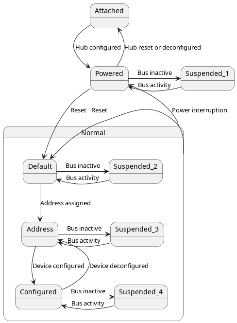
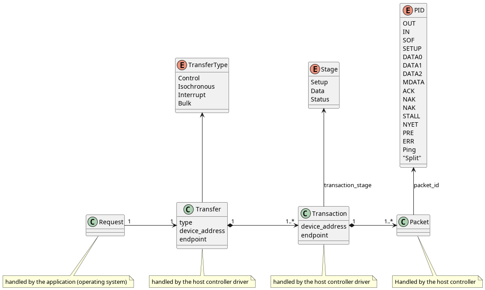

# Design and Implementation

## Limitations

We currently do not handle:

  - Split transfers
  - Isochronous transfers
  - Periodic transfers

## Software Model

1. The USB subsystem is generic. It is found under `/usb.zig`. It provides an API for a Class Driver.
1. At least three classes will be needed: Hub, HID mouse, and HID keyboard.
1. A Class Driver may be synchronous or asynchronous. How an application communicates with a Class Driver is TBD.
1. The USB host controller driver (HCD) is hardware-specific. It is found under `/drivers`. For Raspberry Pi3, it is `/drivers/dwc_otg_usb.zig`.
1. A USB Device is generic. It is found under `/usb/device.zig`.
1. A Device has at least one Endpoint.
1. A USB Endpoint is generic. It is found in `/usb/endpoint.zig`
2. A USB Function is generic. It is found in `/usb/function.zig`
3. A USB Function has at least one Endpoint. Multiple Endpoints work together to supply the capabilities of the Function.
1. A USB Request is generic. It is found under `/usb/request.zig`
1. The generic structs have references to hardware-specific structs and functions supplied by the host controller driver. These are comptime resolved via type aliases in HAL.
2. Class Drivers should work at the level of Requests and Endpoints. A Class Driver should construct a Request and hand it off to the host controller (HC).
1. A Request must be performed by the host controller.
1. The host controller turns a Request (high level) into a Transfer (low level). 
   1. Each Transfer comprises multiple Transactions. 
   1. Transactions in a Transfer are grouped into Stages.
   2. Each Transaction comprises one or more Packets.
      1. For Transactions in the Setup stage: One Transaction with one Token Packet.
      2. For Transactions in the Data stage: Zero or more Transactions, which each have a Setup packet, zero or more Data packets, and a Status packet.
      2. For Transactions in the Status stage: One Transaction with a Setup packet, zero or more Data packets, and a Status packet.
   1. Each packet has a Packet ID (PID) from the table below.
1. Every Transaction in a Transfer has the same device address and endpoint number as the Transfer.
   1. A Stage has a direction (either host-to-device or device-to-host).
   1. A Stage may have multiple Packets.
1. A Control Transfer comprises the following Stages
   2. Setup stage: a Setup Transaction
   3. Data stage: zero or more Data Transactions
   4. Status stage: a Status Transaction
1. The host controller has multiple Channels. These have no independent representation and are strictly contained within the host controller driver.
1. A Transfer is performed on a Channel. The HCD runs an interrupt-driven state machine to execute the Transfer on a Channel.

## Device initialization

When a device is connected (or detected on power-up scan) we have to take multiple steps before it is ready for use:

1. Device is initially detected with device address zero. Its function is unknown. Its maximum packet size is unknown.
   2. System action: Send a Reset command to the device, then waits for a period of time (how long?)
   3. System action: Perform a control transfer to device address 0 and request `get_descriptor` with decscriptor type `device`. Read the device class, subclass, protocol, max packet size.
   3. System action: Pick an unused device address (call it A1) to assign to the new device. Perform a control transfer to the device address 0, endpoint 0 with a `set_address` request.
2. Device now has an assigned address. Its function is still unknown.
   3. System action: Perform control transfers to A1 to get the Configuration descriptor. Use the interface count to get all interface descriptors. If we find an interface that we support, instantiate a class driver for it.
   4. Class driver: For the given device address and interface descriptor, use the endpoint count to get all endpoint descriptors.
   4. For HID class drivers: find the interrupt endpoints, read and parse the report descriptor(s)
   5. For HID class drivers: start the initial `IN` request

## Hardware Model - RPi3

1. The DWC OTG USB host controller (HC) operates at the level of USB Transactions.
2. A Transaction is handled by a channel.
3. The HC has a set of registers for each channel (out of the 15 channels supported on the chip.)
4. It's up to the application (our operating system) to keep track of which channels are busy.
5. The application (our operating system) sets up a description of the transaction:
   1. Configure the `channel_transfer_size` register, with both the number of packets and the number of bytes.)
   2. The `channel_transfer_size` register is also where the initial PID goes. (I.e., `SETUP`, `DATA0`, etc.) It seems that the host controller updates each successive packet's PID.
   2. Configure the `channel_dma_addr` to point at the data to be sent or where the data will be received.
   3. Configure the `channel_int_mask` according to the expected interrupts.
   4. Configure the `channel_character` with the endpoint number, direction, address, "odd frame" bit, low-speed device bit, disable flag (set to 0), and enable flag (set to 1).
6. It's up to the application to handle NAK, NYET, Stall, and error interrupts.
5. During the transaction, the HCD will update the transfer size and `channel_dma_buffer` address (I think this means `channel_dma_addr` stays the same)
6. A "split" transfer deals with low speed devices on a full- or high-speed bus. There's a lot I don't understand about split transfers, so I hope that we don't actually need to deal with them for the keyboard and mouse.

## Packet IDs (PIDs)

```
Group   Value   Packet Identifier
Token
        0001    OUT
        1001    IN 
        0101    SOF
        1101    SETUP
Data
        0011    DATA0
        1011    DATA1
        0111    DATA2
        1111    MDATA
Handshake
        0010    ACK Handshake
        1010    NAK Handshake
        1110    STALL Handshake
        0110    NYET (No Response Yet)
Special
        1100    PREamble
        1100    ERR
        1000    Split
        0100    Ping
```

## Device State Machine



## Transfer Logical Model

This is meant to depict the relationships of the actions. Not all of these are reified as structures.



# References

[RiscOS implementation of DWC driver](https://gitlab.riscosopen.org/RiscOS/Sources/HWSupport/USB/Controllers/DWCDriver/-/tree/master)


